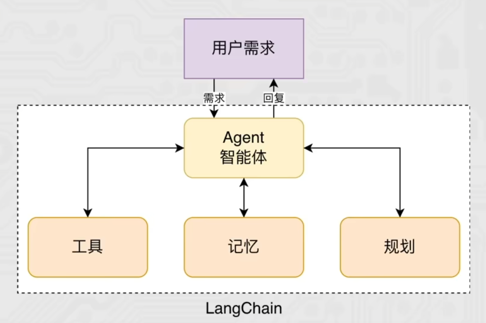
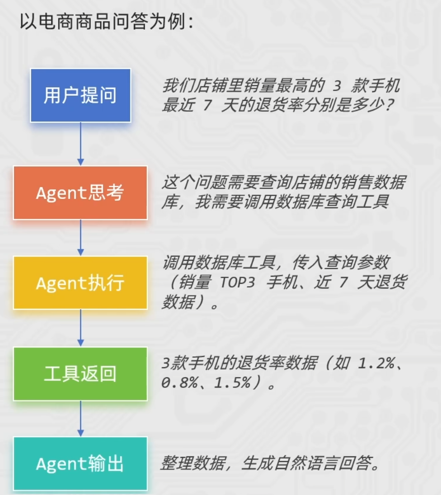
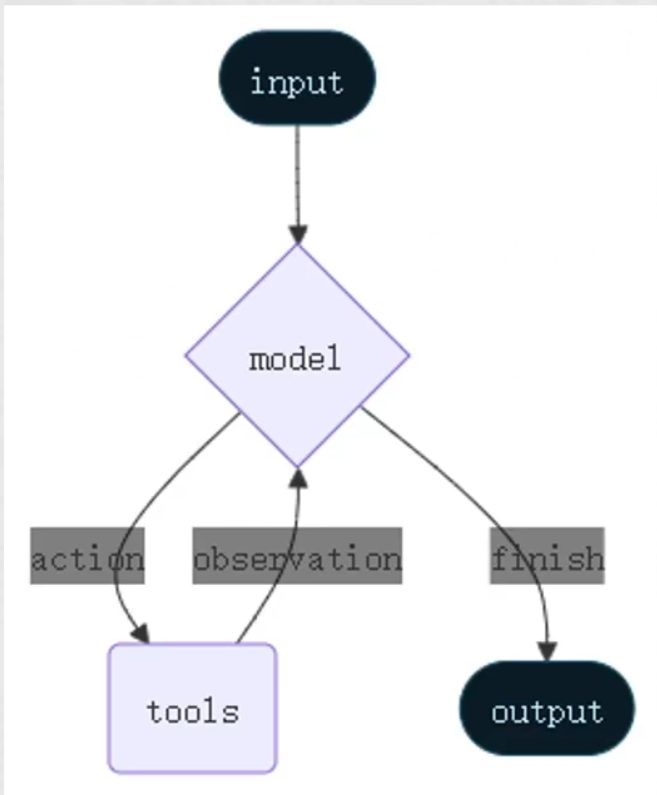
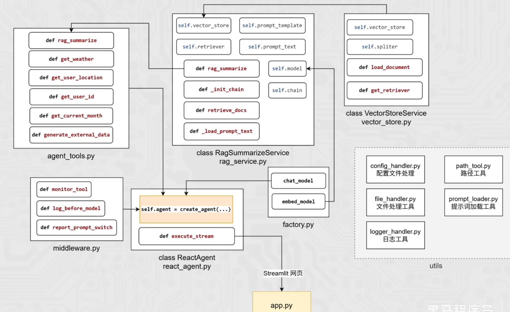

# **Agent**



智能体(Agent) 是一种能够自主规划、决策、执行任务的组件，核心是让大语言模型(LLM)根据任务需求，选择并调用工具，完成单靠模型自身无法解决的复杂问题。

* 没有Agent时，LLM 只能基于自身训练数据回答问是题，遇到需要实时数据、复杂计算、外部工具调用的场景就会卡壳。
* 有了Agent后，LLM就像一个"指挥官"，能思考任务步骤->选择合适工具->执行工具调用>根据结果调整策略，直到完成。

核心特点:

* **目标驱动**:围绕用户的具体任务目标展开工作。
* **工具调用能力**:能连接外部工具，弥补LLM的局限性。
* **自主决策与迭代**:不需要人工干预，能根据工具返回的结果，判断是否需要继续调用工具，或直接生成最终答案。

**普通 Chain
执行流程固定，按预设步骤运行
工具调用路径写死在代码里
适合简单、标准化任务**

**Agent
执行流程动态，根据任务和结果自主调整
工具选择由LLM思考决定
适合复杂、多步骤、需要决策的任务**



Agent智能体=大语言模型(大脑)+工具集(手脚)+决策逻辑(思维)，是让LLM从"只会回答"升级为"会做事(影响现实世界)"的智能助手。

Agent智能体核心：工具调用

基于外部工具的提供，让大模型拥有了：感知外部世界并影响现实的能力。
丰富的工具集将极大提升大模型的工作性能和业务范畴。
工具越多，Agent能覆盖的业务场景就越广（从客服问答到库存管理，再到自动化运营），性能和实用性自然会大幅提升。

# **ReAct**



Agent ReAct是大模型智能体的核心思考与行动框架，全称Reasoning+Acting（推理+行动），是让Agent像人
类一样「思考问题→制定策略→执行行动→验证结果」的关键逻辑。
简单来说：ReAct让Agent不再是“直接回答问题”，而是通过“自然语言思考过程”指导工具调用，一步步解决复杂问题，
完美适配需要多步推理、工具协作的场景（如智能客服、报告生成、任务规划等）。

一个典型的ReAct范式的Agent如图所示：

* **思考Reasoning**：分析问题，判断现有信息是否足够，明确下一步
  即模型决策是否需要调用外部工具获取更多信息用来回答
* **行动Action**：执行思考阶段指定的策略
  即基于模型决策结果，调用工具获取信息
* **观察observation**：获取行动的结果，提取有效信息
  即获取工具返回值即判断工具是否正常工作位下一轮思考提供信息
* **（再）思考（再）行动（再）观察循环往复直到结束**

ReAct是一种工作范式，定义了大模型的工作流程。
思考：分析需求，考虑下一步
行动：工具调用获取信息
观察：分析获取的信息
思考→行动>观察思考……结束
Langchain的Agent对象，就是按ReAct模式运行，在执行过程中会持续（再）思考（再）行动（再）观察。

# **中间件（middleware）**

中间件的作用是对智能体的每一步工作进行控制和自定义的执行。
作用场景：
日志记录、分析、调试
转换提示词、工具选择
重试、备用、提前终止等逻辑控制
安全防护、个人身份检测等

LangChain中内置了一些基础的中间件，参见:https://docs.langchain.com/oss/python/langchain/middleware/built-in
中间件通过Hooks钩子来实现拦截，自定义中间件可以简单的使用装饰器来定义。

节点式钩子（执行点顺序拦截）：
before_agent:agent执行之前拦截
after_agent:agent执行后拦截
before_model:模型执行前拦截
after_model：模型执行后拦截

针对工具和模型的包装式钩子：
wrap_model_call:每个模型调用时候拦截
wrap_tool_call:每个工具调用时候拦截

# Agent项目

## **Agent项目介绍**

智扫通Agent项目是一个面向消费者（toC）的智能客服系统，旨在为用户提供全周期的扫地机器人相关服务。
(1）智能问答服务：

* 处理购买前的产品咨询（如功能、价格、对比等）。
* 解决购买后的使用问题（如操作指导、故障处理、维护建议等）。
* 基于RAG技术，从知识库中检索准确信息并生成自然语言回答，确保响应及时且可靠。


(2）使用报告与优化建议生成：

* 针对已购买用户，自动分析扫地机器人的使用数据（如清洁频率、耗材状态、错误日志等）。
* 生成个性化报告，总结使用情况并提供优化建议（如清洁计划调整、部件更换提醒等）。
* 支持用户主动查询报告或系统定期推送，帮助用户最大化产品价值。




```mermaid
flowchart LR
    %% 前端入口
    UI[前端页面 / Streamlit 应用] -->|用户问题/指令| APP[app.py 应用入口]    %% 智能体与工具
    APP --> RA[ReactAgent\nreact_agent.py]
    RA -->|调用工具| AT[Agent Tools\nagent_tools.py]
    RA -->|监控/埋点| MW[middleware.py]    %% RAG 服务
    AT -->|RAG 查询| RAG[rageSummarizeService\nrag_service.py]
    RAG -->|检索文档| VS[VectorStoreService\nvector_store.py]    %% 模型层
    RAG -->|调用大模型| CM[Chat Model]
    RAG -->|生成向量| EM[Embedding Model]
    CM & EM --> MF[Model Factory\nfactory.py]    %% 知识库与数据
    VS -->|加载/构建索引| KB[(RAG 知识库\n文本/向量存储)]
    KB --- DATA[data 目录\n原始文档]    %% 配置与工具
    APP --> CFG[配置管理\nconfig_handler.py]
    CFG --> CONF[配置文件\nconfig 目录]  
APP --> ULOG[日志工具\nlogger_handler.py]
    AT  --> FH[file_handler.py]
    AT  --> PL[prompt_loader.py]    %% 用户数据分析与报告
    APP -->|上报使用数据| UD[(用户使用数据)]
    UD --> AT
    AT -->|生成报告/建议| UI
```
